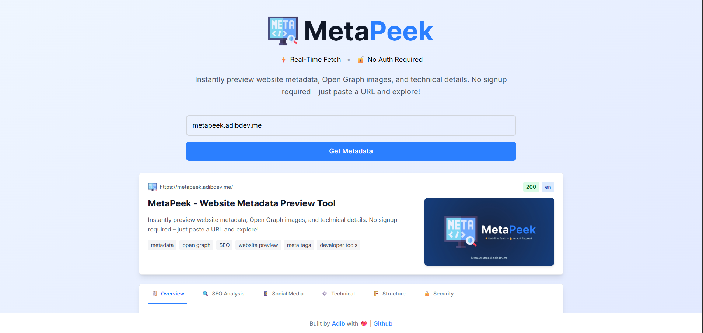
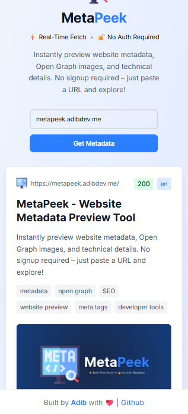

<p align="center">
  
</p>

<h3 align="center">A simple and elegant tool to fetch and preview website metadata.</h3>

<p align="center">
  <a href="https://github.com/adib23704/MetaPeek/actions/workflows/build.yml">
    
  </a>
  
  
  
  
</p>

---

MetaPeek is a web application that allows you to enter a URL and instantly see its metadata—including the title, description, and preview image. It's a handy tool for developers, content creators, and social media managers to check how a link will appear when shared across different platforms.

### Live: https://metapeek.adibdev.me

## ✨ Features

- **Instant Metadata Fetching:** Get a website's metadata in real-time.
- **Social Media Preview:** See how a link will look on platforms like Twitter and Facebook by previewing Open Graph and Twitter Card data.
- **Clean & Responsive UI:** A modern, simple, and mobile-friendly interface built with Tailwind CSS.
- **API Endpoint:** A dedicated API route to fetch metadata, which can be integrated into other projects.
- **Error Handling:** Clear error messages for invalid URLs or fetching issues.

## 🛠️ Tech Stack

- **Framework:** [Next.js](https://nextjs.org/)
- **Library:** [React](https://reactjs.org/)
- **Styling:** [Tailwind CSS](https://tailwindcss.com/)
- **Backend API:** Next.js API Routes
- **HTTP Requests:** [Axios](https://axios-http.com/)
- **HTML Parsing:** [Cheerio](https://cheerio.js.org/)
- **Linting & Formatting:** ESLint & Prettier

## 📸 Screenshots

| Desktop                                                | Mobile                                               |
| ------------------------------------------------------ | ---------------------------------------------------- |
|  |  |

## 🚀 Getting Started

### Prerequisites

- [Node.js](https://nodejs.org/en/) (v20.x or later recommended)
- [npm](https://www.npmjs.com/)

### Installation & Setup

1.  **Clone the repository:**

    ```sh
    git clone https://github.com/adib23704/MetaPeek.git
    ```

2.  **Navigate to the project directory:**

    ```sh
    cd MetaPeek
    ```

3.  **Install dependencies:**

    ```sh
    npm install
    ```

4.  **Run the development server:**
    ```sh
    npm run dev
    ```
    Open [http://localhost:3000](http://localhost:3000) with your browser to see the result.

**Build for production:**

```sh
npm run build
```

## 🔌 API Endpoint

- **URL:** `/api/fetchMeta`
- **Method:** `POST`
- **Request Query:** `?url=https://example.com`
- **Success Response (200):**
  A JSON object containing the fetched metadata.
  ```json
  {
  	"title": "Example Domain",
  	"description": "An example description...",
  	"image": "https://example.com/image.png",
  	"ogTitle": "Example Open Graph Title",
  	"ogDescription": "Example Open Graph description...",
  	"ogImage": "https://example.com/og-image.png",
  	"siteName": "Example Site",
  	"icon": "/favicon.ico"
  }
  ```
- **Error Response (4xx - 5xx):**
  ```json
  {
  	"error": "A descriptive error message."
  }
  ```

## 📂 Project Structure

```
MetaPeek/
├── src/
│   ├── app/
│   │   ├── api/
│   │   │   ├── fetchMeta/
│   │   │   │   └── route.js          # Main metadata extraction API
│   │   ├── components/
│   │   │   ├── URLInput.js           # URL input form component
│   │   │   ├── MetadataPreview.js    # Main preview component
│   │   │   ├── ErrorMessage.js       # Error handling component
│   │   ├── globals.css               # Global styles with Tailwind
│   │   ├── layout.js                 # Root layout component
│   │   ├── page.js                   # Main page component
├── public/
├── .eslintrc.json                    # ESLint configuration
├── .prettierrc.json                  # Prettier configuration
├── postcss.config.mjs                # PostCSS configuration
├── next.config.js                    # Next.js configuration
└── package.json
```

## 🤝 Contributing

Contributions are what make the open-source community such an amazing place to learn, inspire, and create. Any contributions you make are **greatly appreciated**.

If you have a suggestion that would make this better, please fork the repo and create a pull request. You can also simply open an issue with the tag "enhancement".

1.  Fork the Project
2.  Create your Feature Branch (`git checkout -b feature/AmazingFeature`)
3.  Commit your Changes (`git commit -m 'Add some AmazingFeature'`)
4.  Push to the Branch (`git push origin feature/AmazingFeature`)
5.  Open a Pull Request

## 📄 License

Distributed under the MIT License. See `LICENSE` for more information.

---

<p align="center">
  Made with ❤️ by adib23704
</p>
